# MCB COMMITTEE MEETING

## Carlos Avendaño

### Spring 2026

---
layout: full
---

# Background

## Undergrad

- Oregon State University
- Degree in Marine Biology
- During the pandemic did a computational internship with NOAA

## After graduating
- Worked in the Greninger lab studying rhinovirus and _treponema pallidum_
- MCB University of Washington Studying computational epidemiology

---

# Short term goals

- TDS IRC Retreat
- Finish last TAship this summer
- General exam end of fall term

# Long term goals

- Staff Scientist at major research institution or government
- Outreach work
  - Data Viz

---
layout: section
---

## Aim 1: 
## Using Viral DASMs to predict viral fitness

---
layout: section
---

## Protein language models (PLMs) such as ESM are trained on millions of proteins, but are not very effective at viral forecasting

---
layout: default
---

  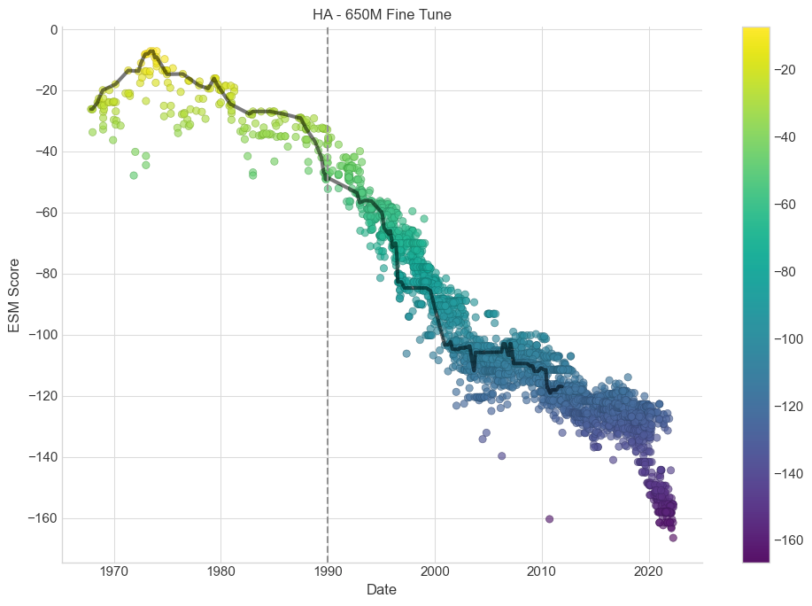

<h3 style="text-align: center;">ESM is unable to infer outside its training window</h3>

---
layout: center
---

# DASM

- Deep antibody-specific model (DASM) 

- Developed by the Matsen lab is a new model trained on parent-child pairs of antibodies

---
layout: 
---

<h3 style="text-align: center;">Masked language models learn the codon table</h3>

    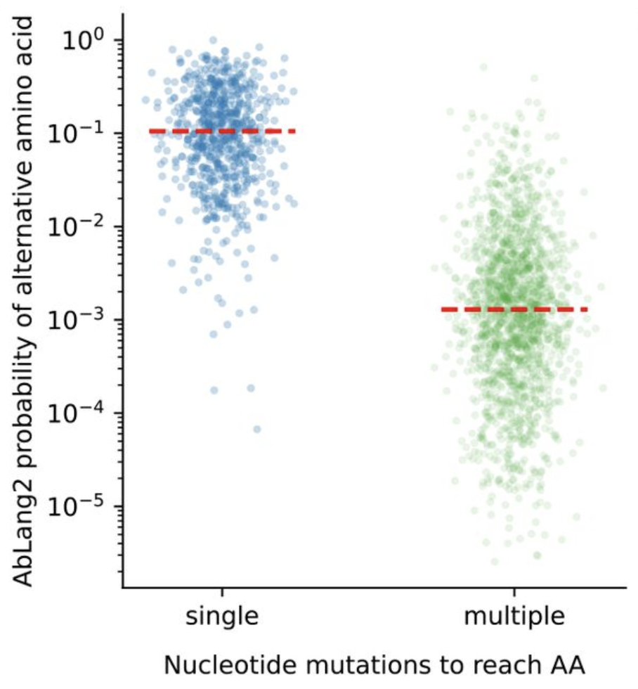
  

---
layout: 
---

<h3 style="text-align: center;">Masked language models learn the codon table</h3>

    
  

  

 Ablang2 predicts amino acids mutations that require multiple nucleotide changes to be 100 times less likely than single nucleotide changes

---

# Masked language models

- Masked language models treat all mutations the same
  - Sites that mutate more often are included more in the training data
  - Treated more favorability according to the model regardless of fitness impact

- Single nucleotide codon mutations happen more often under somatic hypermutation, but this does not mean these mutations are more fit

---
layout: center
---

# DASMs

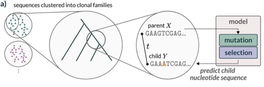

- Phylogenetic trees are made with clonal families
- DASMs are trained to predict the child sequence
  - Trained on 2 million parent child pairs

---
layout: center
---

# What makes DASMs different

- DASMs separate functional mutation predictions and the neutral mutation process
- DASMs factor out nucleotide mutation biases

**Neutral mutations × Selection**

---

# DASMs

Produce selection matrix similar to a deep mutational like scan

  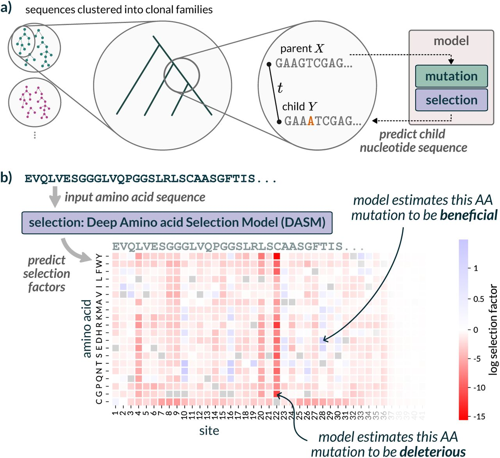

---

  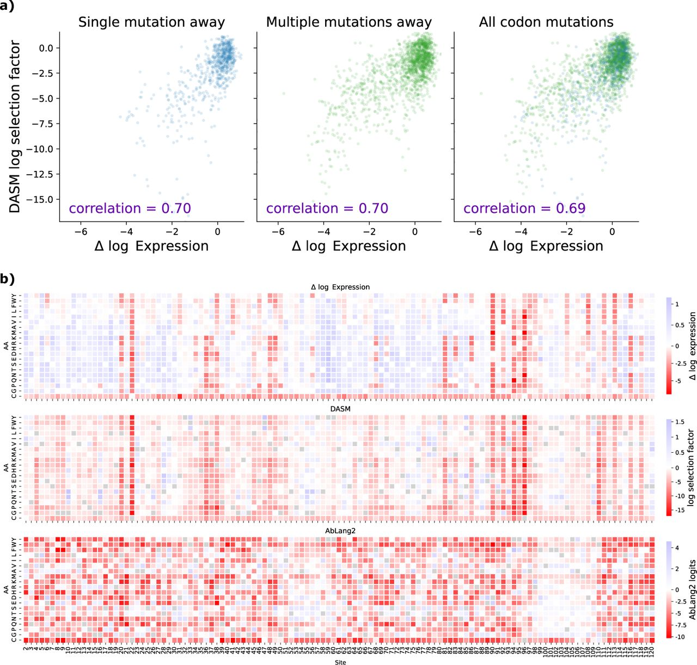

DASMs mimic patterns in expression data

---
layout: quote
---

# DASMs

- Can outperform larger PLMs despite being trained on a smaller protein dataset
- The model is trained to capture underlying biological processes of the human immune system

---
layout: quote
---

# DASMs for Viruses

- The Matsen lab has been developing a viral version of DASM
- SARS-CoV-2 models are trained on large Usher trees

---
layout: center
---

$$p_{j,m}(X) = \frac{\lambda_{j,m}(X) \times S_{j,m}(\bar{X})}{Z}$$

<h3 style="text-align: center; font-size: 1.5rem; font-weight: 600; margin-top: 1.5rem;">Viral DASMs separate neutral mutation and selection</h3>

---
layout: center
---

  neutral mutation rate
  selection factor

$$p_{j,m}(X) = \frac{\lambda_{j,m}(X) \times S_{j,m}(\bar{X})}{Z}$$

  probability of mutation m at position j
  normalization

<FancyArrow from="[data-id=label-p]@top" to="(290, 300)" color="#888" width="2" />
<FancyArrow from="[data-id=label-lambda21]@bottom" to="(490, 205)" color="#888" width="2" />
<FancyArrow from="[data-id=label-S21]@bottom" to="(680, 205)" color="#888" width="2" />
<FancyArrow from="[data-id=label-Z21]@top" to="(610, 325)" color="#888" width="2" />

---
layout: center
---

$$Z = \sum_{j'} \sum_{m'} \lambda_{j'm'} \times S_{j'm'}$$

<h3 style="text-align: center; margin-top: 2rem;">Normalization is done so probability scores are bounded between 0 and 1</h3>

---
layout: center
---

$$Z = \sum_{j'} \sum_{m'} \lambda_{j'm'} \times S_{j'm'}$$

  normalization constant
  mutation rate at position j for AA m
  selection factor at position j for AA m

<FancyArrow from="[data-id=label-Z]@top" to="(280, 255)" color="#888" width="2" />
<FancyArrow from="[data-id=label-lambda]@top" to="(520, 255)" color="#888" width="2" />
<FancyArrow from="[data-id=label-S]@top" to="(670, 255)" color="#888" width="2" />

---
layout: center 
---

$$p_{j,m}(X) = \frac{\textcolor{red}{\lambda_{j,m}(X)} \times S_{j,m}(\bar{X})}{Z}$$

<h3 style="text-align: center; font-size: 1.5rem; font-weight: 600; margin-top: 1.5rem; color: red;">DASMs include a model to account for neutral mutations</h3>

---
layout: center
---

# The neutral model accounts for bias in mutations from:

- mutation type
- local sequence context
- RNA secondary structure 
- gene region

# 

Haddox et al

---
layout: center 
---

$$p_{j,m}(X) = \frac{{\lambda_{j,m}(X)} \times \textcolor{red}{S_{j,m}(\bar{X})}}{Z}$$

<h3 style="text-align: center; font-size: 1.5rem; font-weight: 600; margin-top: 1.5rem; color: red;">The selection model is a transformer architecture trained on parent child relationships from a phylogenetic tree</h3>

---

# Based on the Bloom-Neher model

  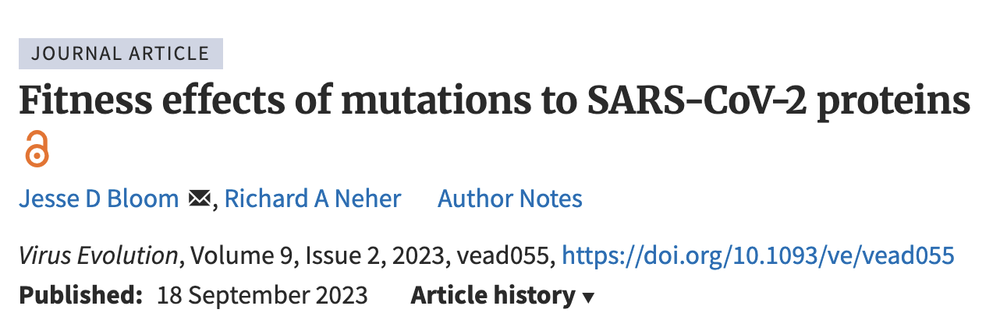

---

  

The ratio of expected and actual mutation counts is determined

---

  

Fitness of mutations for a given clade is determined by how commonly a mutation is seen relative to the rest of the tree

---
layout: center
---

$$
g_{jm} = \log \left(\frac{a_m}{e_m}\right)
$$

---
layout: center
---

$$g_{jm} = \log \left(\frac{a_m}{e_m}\right)$$

change in fitness at position j, AA m
  actual ÷ expected mutation counts

<FancyArrow from="[data-id=label-ratio]@top" to="(580, 300)" color="#888" width="2" />
<FancyArrow from="[data-id=label-g]@top" to="(350, 270)" color="#888" width="2" />

---
layout: center
---

<h3 style="text-align: center; margin-top: 5rem;">Viral DASMs separate neutral mutation and selection</h3>

---
layout: section
---

## Can a viral DASM outperform a naive spike counts model

---

The number of spike mutations roughly correlates with the fitness of SARS-CoV-2.

  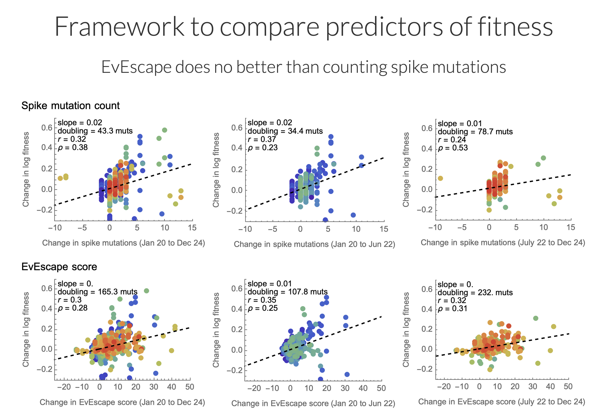

<em>From fitness flux — Trevor Bedford</em>

---

# Most Protein Language Models perform worse than a naive spike mutation model

- ESM2: a protein language model trained on millions of diverse proteins from the Uniprot database
- CoVFit: a fine-tuned model of ESM2, with additional training heads, designed to predict the fitness of future SARS-CoV-2 sequences
- EvEscape: a model which incorporates antibody escape predictions

---

# Why DASMs may be able to perform better

- Naïve spike model: not all mutations increase fitness by the same amount (or are even all beneficial)
- Masked language model: doesn't account for neutrality or mutations less common in the dataset
- DASMs are trained using phylogenetic trees — they can learn parent-child pair relationships

---
layout: center
---

## Evaluating viral DASMs

---
layout: quote
---

  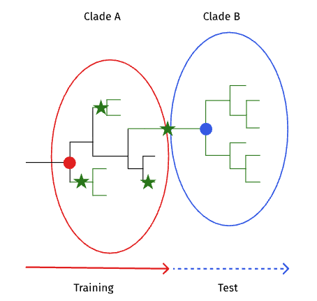

A founder sequence or a clade-defining node will be used to represent a clade

---
layout: quote
---

  

Although the model has not been trained on the sequences in clade b, the mutation may appear multiple times in clade a before later being fixed in clade b.

---
layout: quote
---

  

DASMs may treat these mutations as fit because they arise independently multiple times before becoming fixed.

---

  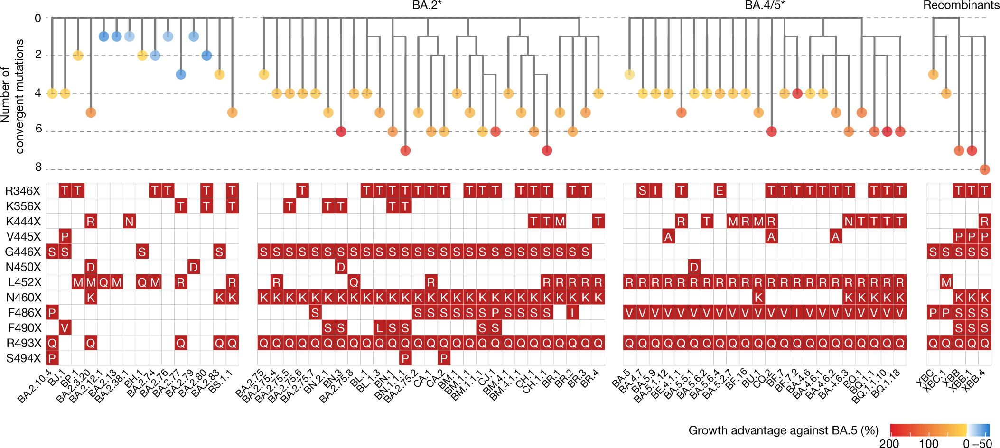

<h3 style="text-align: center; margin-top: 2rem;">Mutations can have increased fitness effects before becoming fixed</h3>

<em>Cao, Y. et al. Nature</em>

---

  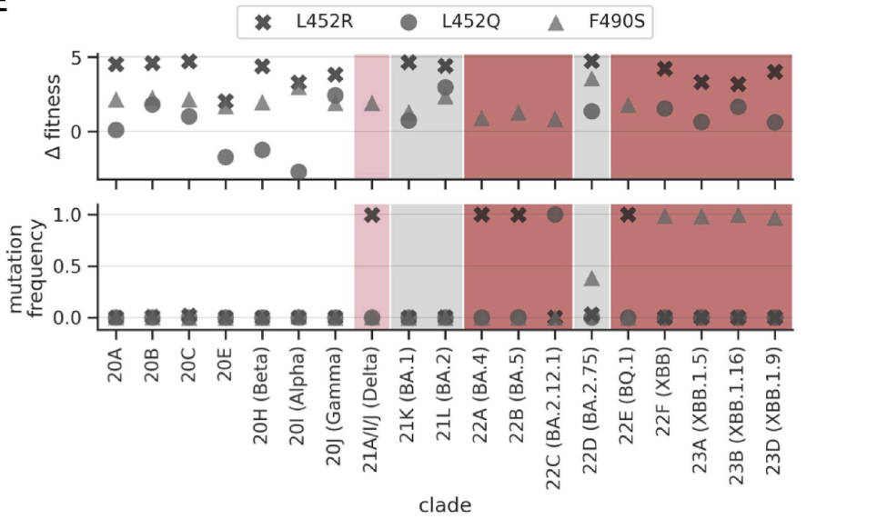

L452R has a high fitness effect in the BA.1 and BA.2 clades but is fixed in BA.4/5

<em>Haddox et al. Virus Evolution</em>

---
layout: quote
---

  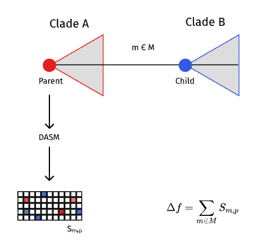

Spike mutations that differ between parent-child pairs will be run through DASM

---
layout: section
---

  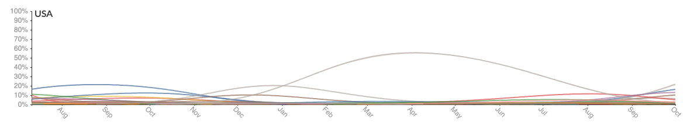

DASM predictions will be validated against MLR fitness estimates

---
layout: center
---

  $$f_v(t) = \frac{\exp(\alpha_v + \delta_v t)}{\sum_u \exp(\alpha_u + \delta_u t)}$$

  $f_v(t)$ = Predicted frequency at a given point in time

  $\alpha_v$ = Starting frequency

  $\delta_v$ = Growth rate (constant unless using the time dependent model)

  $\exp()$ = Ensures the output remains positive
---
layout: center
---

# Growth advantage

- Constant value given to a clade
- Is a measure of how fast a clade grows relative other clades

---
layout: end
---
# thank you
---

